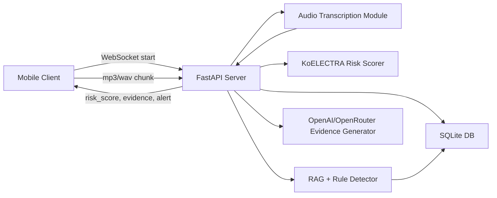

# KNU_AI_BOOT_Project_7조

## 보이스피싱 탐지 및 예방 AI 서비스

실시간 통화 음성을 3~4초 단위로 받아 전사하고, 누적 통화 내용을 기반으로 보이스피싱 위험도와 핵심 근거를 클라이언트에 반환하는 FastAPI 기반 백엔드입니다.

## 멤버

- 박준영
- 이재현
- 장지훈
- 최세민

## 서비스 정의

VoiceGuard AI는 통화 중 발생하는 보이스피싱 위험 신호를 실시간으로 탐지하는 서비스입니다.

- 프론트엔드는 통화 시작 시 WebSocket을 연결하고, 이후 mp3/wav 오디오 chunk를 백엔드로 전송합니다.
- 백엔드는 오디오를 전사해 통화 발화 로그로 저장합니다.
- 누적 통화 내용은 KoELECTRA 모델과 RAG/규칙 기반 탐지 로직으로 분석됩니다.
- 위험도가 높으면 피싱 유형, 위험도 수치, 주요 키워드, 핵심 근거, 알림 정보를 클라이언트에 반환합니다.
- 모든 통화 기록, 발화 내용, 탐지 결과, 알림 이력은 SQLite DB에 저장됩니다.

## 주요 기능

- 실시간 mp3/wav 오디오 chunk WebSocket 수신
- 오디오 전사 결과를 통화 내용 로그로 저장
- KoELECTRA 기반 보이스피싱 위험도 산출
- RAG 기반 유사 사례 검색 및 근거 생성
- 규칙 기반 주요 위험 패턴 탐지
- 정상 금융상담 과탐지 보정
- 통화 기록 목록/상세 조회 API
- mp3/wav/m4a 녹음 파일 업로드 분석 API 기반 구조
- OpenAI/OpenRouter 기반 핵심 근거 생성
- LLM 호출 실패 시 템플릿 근거 자동 대체

## 아키텍처



## 파일 구조

```text
backend/
  app/
    main.py                   # FastAPI 앱 생성, lifespan, router 등록
    api/
      routes.py               # REST API: health, calls, training-cases, analyze-audio
      websocket.py            # WebSocket 실시간 오디오 chunk 분석
    services/
      audio_transcriber.py    # mp3/wav 전사, base64, 오디오 포맷 정규화
      call_analyzer.py        # KoELECTRA/RAG 분석, 탐지 결과 저장, 응답 생성
      koelectra_scorer.py     # KoELECTRA 모델 로드 및 위험도 점수 계산
      rag_detector.py         # RAG 유사 사례 검색 및 규칙 기반 패턴 탐지
      evidence_generator.py   # OpenAI/OpenRouter 또는 템플릿 기반 근거 생성
    repository.py             # SQLite CRUD 및 조회 응답 조립
    database.py               # SQLite 연결과 테이블 초기화
    paths.py                  # 프로젝트 루트 기준 data/models/.env 경로 관리
    schemas.py                # Pydantic 요청/응답 스키마
    train_transformer.py      # KoELECTRA fine-tuning 학습 스크립트
    predict_transformer.py    # 학습된 KoELECTRA 모델 추론 스크립트
data/
  PhishCatch-Data.json        # KoELECTRA 학습 데이터
  voice_phishing.db           # SQLite DB
models/
  koelectra/                  # 학습된 KoELECTRA 모델 파일
API_SPEC.md                   # API 요청/응답 명세
requirements.txt              # Python 의존성
```

API 계층(`backend/app/api`)은 요청/응답 처리만 담당하고, 실제 분석 로직은 서비스 계층(`backend/app/services`)으로 분리했습니다. DB 접근은 `repository.py`로 모아 API와 저장소 구현이 직접 섞이지 않도록 구성했습니다.

### 처리 흐름

1. 클라이언트가 `WS /ws/calls/analyze`에 연결합니다.
2. 클라이언트가 `start` JSON을 보내면 백엔드는 `call_logs`에 통화 기록을 생성합니다.
3. 클라이언트가 3~4초 단위 mp3/wav 바이너리 frame을 전송합니다.
4. 백엔드는 오디오 chunk를 전사하고 `call_messages`에 저장합니다.
5. 저장된 전체 통화 내용을 KoELECTRA로 점수화합니다.
6. RAG/규칙 탐지로 주요 키워드와 유사 사례 근거를 생성합니다.
7. 탐지 결과를 `detection_results`에 저장합니다.
8. 고위험이면 `notification_logs`에 알림 이력을 저장하고 클라이언트에 `audio_phishing_detected`를 반환합니다.

## 사용 기술

| 구분 | 기술 |
| --- | --- |
| Backend | Python, FastAPI, Uvicorn |
| API 통신 | REST API, WebSocket |
| 데이터 저장 | SQLite |
| 데이터 검증 | Pydantic |
| AI 모델 | KoELECTRA, PyTorch, Transformers |
| 모델 학습 | scikit-learn, HuggingFace Trainer, Accelerate |
| RAG 검색 | SQLite 저장 사례 + 문자 n-gram cosine similarity |
| 생성형 근거 | OpenAI 호환 SDK, OpenRouter 지원 |
| 환경 변수 | python-dotenv |
| 파일 업로드 | python-multipart |

## 필요 라이브러리

`requirements.txt` 기준 주요 라이브러리는 아래와 같습니다.

```text
fastapi
uvicorn[standard]
python-multipart
pydantic
openai
python-dotenv
urllib3
av
numpy
scikit-learn
torch
transformers
accelerate
```

오디오 전사는 `backend.app.mp3_json.transcribe_with_speakers`를 호출합니다. OpenRouter API의 멀티모달 모델(기본 `google/gemini-3.5-flash`, `STT_MODEL` 환경변수로 변경 가능)이 전사·화자 구분·타임스탬프를 한 번에 수행하며, `.env`의 `OPENROUTER_API_KEY`가 필요합니다. 녹음파일 업로드 분석은 `mp3`, `wav`, `m4a`를 지원하고, `m4a`는 서버에서 임시 `wav`로 변환합니다.

## 설치 방법

Python 3.9 이상 환경을 권장합니다.

```bash
python3 -m venv .venv
source .venv/bin/activate
pip install -r requirements.txt
```

macOS 기본 Python의 LibreSSL 경고를 피하기 위해 `urllib3<2`를 사용합니다.

## 환경 변수 설정

LLM 기반 근거 생성을 사용하려면 프로젝트 루트에 `.env`를 생성합니다.

OpenAI API를 사용할 경우:

```env
OPENAI_API_KEY=sk-...
LLM_MODEL=gpt-4o-mini
```

OpenRouter 키를 사용할 경우:

```env
OPENAI_API_KEY=sk-or-v1...
OPENAI_BASE_URL=https://openrouter.ai/api/v1
LLM_MODEL=openai/gpt-4o-mini
OPENROUTER_APP_TITLE=VoiceGuard AI
```

CORS 허용 origin은 기본 개발 포트(`3000`, `5173`, `8080`, `8081`)가 포함되어 있으며, 추가 origin은 `.env`의 `CORS_ALLOW_ORIGINS`에 쉼표로 구분해 설정합니다.

```env
CORS_ALLOW_ORIGINS=http://172.16.83.29:5173,http://172.16.80.202:8081
```

API 키가 없거나 호출에 실패하면 템플릿 기반 근거가 자동으로 반환됩니다.

## 학습 데이터 준비

KoELECTRA 학습 스크립트는 아래 파일을 사용합니다.

```text
data/PhishCatch-Data.json
```

학습 데이터 JSON 형식:

```json
{
  "cases": [
    {
      "id": "phishing_call_001",
      "label": 1,
      "turns": [
        {
          "turn_index": 1,
          "role": "speaker_a",
          "text": "검찰입니다."
        },
        {
          "turn_index": 2,
          "role": "speaker_b",
          "text": "네?"
        }
      ]
    }
  ]
}
```

`label`은 보이스피싱이면 `1`, 정상이면 `0`입니다. `id`는 통화/세션 한 건을 구분하는 값이고, 한 통화 안의 발화는 `turns[].turn_index`로 구분합니다.

## KoELECTRA 모델 학습

학습 데이터가 준비된 상태에서 아래 명령을 실행합니다.

```bash
.venv/bin/python -m backend.app.train_transformer
```

학습이 끝나면 아래 경로에 모델 파일이 생성됩니다.

```text
models/koelectra
```

서버 시작 시 `models/koelectra`가 없으면 KoELECTRA 점수 계산을 사용하지 않고 RAG/규칙 기반 점수로 대체합니다.

## 서버 실행 방법

일반 실행:

```bash
uvicorn backend.app.main:app
```

같은 네트워크의 프론트/모바일 기기에서 백엔드에 접속해야 하면 `0.0.0.0`으로 실행합니다.

```bash
uvicorn backend.app.main:app --host 0.0.0.0 --port 8000
```

현재 Mac의 IP가 `172.16.83.29`라면 프론트에서는 아래 주소를 사용합니다.

```text
http://172.16.83.29:8000
ws://172.16.83.29:8000/ws/calls/analyze
```

개발 중 자동 reload 실행:

```bash
uvicorn backend.app.main:app --reload --reload-dir backend --reload-exclude ".venv/*" --reload-exclude ".venv/**"
```

서버 실행 후 Swagger 문서는 아래 주소에서 확인할 수 있습니다.

```text
http://127.0.0.1:8000/docs
```

상태 확인:

```bash
curl http://127.0.0.1:8000/health
```

## 학습 사례 업로드

RAG 검색에 사용할 정상/피싱 사례 JSON을 업로드합니다.

```bash
curl -X POST "http://127.0.0.1:8000/training-cases/import-json" \
  -F "file=@data/PhishCatch-Data.json"
```

## 실시간 통화 음성 분석

WebSocket 주소:

```text
ws://127.0.0.1:8000/ws/calls/analyze
```

통화 시작 메시지:

```json
{
  "type": "start",
  "device_id": 1,
  "name": "010-1234-5678",
  "audio_format": "wav"
}
```

통화 시작 이후 클라이언트는 3~4초 단위의 mp3/wav 오디오를 WebSocket binary frame으로 전송합니다.

```text
<3~4초 wav 또는 mp3 binary frame>
```

테스트 도구에서 바이너리 frame 전송이 어려우면 base64 JSON 방식도 사용할 수 있습니다.

```json
{
  "type": "audio_chunk",
  "chunk_index": 1,
  "audio_format": "wav",
  "audio_base64": "UklGR..."
}
```

정상 응답:

```json
{
  "type": "audio_analysis_ack",
  "log_id": 1,
  "chunk_index": 1,
  "message_ids": [12],
  "is_phishing": false,
  "risk_score": 0.12,
  "risk_level": "low",
  "phishing_type": "정상"
}
```

피싱 탐지 응답:

```json
{
  "type": "audio_phishing_detected",
  "log_id": 1,
  "chunk_index": 3,
  "message_ids": [13],
  "is_phishing": true,
  "risk_score": 0.86,
  "risk_level": "high",
  "phishing_type": "수사기관 사칭",
  "matched_patterns": ["수사기관/공공기관 사칭", "범죄 연루 압박"],
  "core_evidence": "수사기관 사칭 표현과 범죄 연루 압박 표현이 탐지되었습니다.",
  "notification": {
    "id": 3,
    "message": "보이스피싱 위험이 높게 탐지되었습니다. 통화를 종료하고 공식 대표번호로 확인하세요.",
    "status": "sent",
    "created_at": "2026-07-10 10:21:03"
  }
}
```

## 주요 API

| Method | Path | 설명 |
| --- | --- | --- |
| GET | `/health` | 서버 상태 확인 |
| POST | `/training-cases/import-json` | 학습/RAG 사례 JSON 업로드 |
| GET | `/training-cases` | 저장된 학습 사례 조회 |
| GET | `/calls` | 통화 기록 목록 및 위험 등급별 개수 조회 |
| GET | `/calls/{log_id}` | 통화 기록 상세 조회 |
| POST | `/calls/analyze` | 녹음 파일 업로드 분석 |
| POST | `/calls/analyze-audio` | 녹음 파일 업로드 분석 호환 엔드포인트 |
| WS | `/ws/calls/analyze` | 실시간 오디오 chunk 분석 |

자세한 요청/응답 예시는 `API_SPEC.md`를 참고합니다.

## DB 저장 구조

| 테이블 | 역할 |
| --- | --- |
| `training_cases` | RAG/학습용 정상·피싱 사례 |
| `training_case_turns` | 학습 사례의 발화 단위 데이터 |
| `call_logs` | 통화 기록 및 최신 위험 상태 |
| `call_messages` | 전사된 통화 발화 로그 |
| `detection_results` | 각 분석 시점의 위험도와 근거 |
| `notification_logs` | 고위험 탐지 시 알림 이력 |

## 위험도 기준

```text
low: risk_score < 0.45
medium: 0.45 <= risk_score < 0.75
high: risk_score >= 0.75
```

KoELECTRA 기반 실시간 판정에서는 `0.70` 이상부터 피싱 의심으로 처리하고, `0.85` 이상을 강한 경고로 사용합니다.
