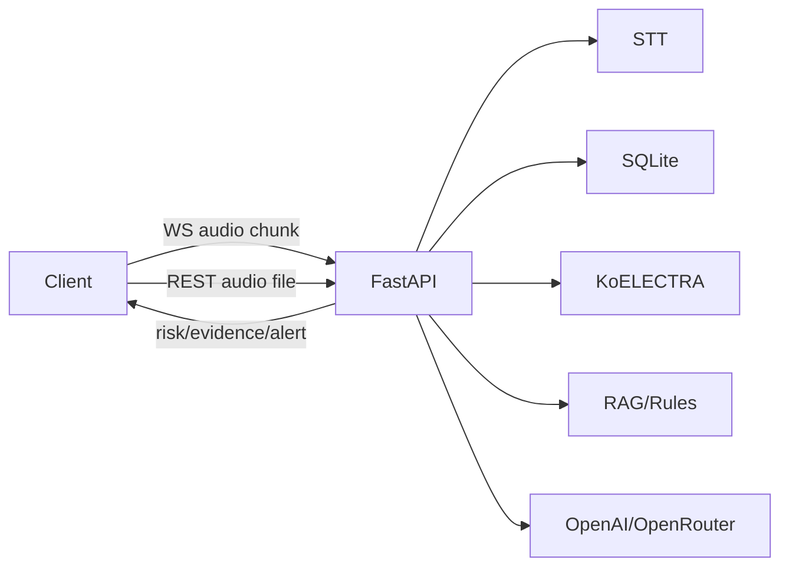

# KNU_AI_BOOT_Project_7조

## 보이스피싱 탐지 및 예방 AI 서비스

실시간 통화 음성을 받아 전사하고, 누적 통화 내용을 기반으로 보이스피싱 위험도와 핵심 근거를 반환하는 FastAPI 백엔드입니다.

## 주요 기능

- WebSocket 기반 실시간 mp3/wav/m4a 오디오 chunk 분석
- mp3/wav/m4a 녹음 파일 업로드 분석
- KoELECTRA 기반 위험도 산출
- RAG/규칙 기반 유사 사례 검색 및 위험 패턴 탐지
- OpenAI/OpenRouter 기반 핵심 근거 생성
- 통화 기록, 발화, 탐지 결과, 알림 이력 SQLite 저장

## 아키텍처



## 프로젝트 구조

```text
backend/app/
  main.py                 # FastAPI 앱 진입점
  api/
    routes.py             # REST API
    websocket.py          # 실시간 통화 WebSocket
  services/
    audio_transcriber.py  # 오디오 입력 정규화 및 전사 호출
    call_analyzer.py      # 위험도 분석 및 응답 생성
    rag_detector.py       # RAG/규칙 기반 탐지
    evidence_generator.py # 생성형 근거 생성
  database.py             # SQLite 초기화
  repository.py           # DB CRUD
  schemas.py              # Pydantic 스키마
  paths.py                # 공통 경로
data/                     # DB, 학습 데이터
models/                   # 학습 모델
API_SPEC.md               # 상세 API 명세
```

## 사용 기술

- Backend: Python, FastAPI, Uvicorn
- Realtime: WebSocket
- DB: SQLite
- AI: KoELECTRA, PyTorch, Transformers
- RAG: SQLite 사례 검색 + 문자 n-gram similarity
- STT/근거 생성: OpenAI 호환 SDK, OpenRouter

## 설치

```bash
python3 -m venv .venv
source .venv/bin/activate
pip install -r requirements.txt
```

## 환경 변수

프로젝트 루트에 `.env`를 생성합니다.

```env
OPENAI_API_KEY=sk-or-v1...
OPENAI_BASE_URL=https://openrouter.ai/api/v1
LLM_MODEL=openai/gpt-4o-mini
STT_MODEL=google/gemini-3.5-flash
OPENROUTER_APP_TITLE=VoiceGuard AI
CORS_ALLOW_ORIGINS=http://localhost:8081,http://172.16.80.202:8081
```

## 실행

로컬 실행:

```bash
uvicorn backend.app.main:app
```

같은 네트워크의 프론트/모바일에서 접속:

```bash
uvicorn backend.app.main:app --host 0.0.0.0 --port 8000
```

개발 reload:

```bash
uvicorn backend.app.main:app --reload --reload-dir backend --reload-exclude ".venv/*" --reload-exclude ".venv/**"
```

Swagger:

```text
http://127.0.0.1:8000/docs
```

## 핵심 API

| Method | Path | 설명 |
| --- | --- | --- |
| GET | `/health` | 서버 상태 확인 |
| WS | `/ws/calls/analyze` | 실시간 통화 오디오 분석 |
| POST | `/calls/analyze-audio` | 녹음 파일 업로드 분석 |
| GET | `/calls` | 통화 기록 목록 조회 |
| GET | `/calls/{log_id}` | 통화 기록 상세 조회 |
| POST | `/training-cases/import-json` | RAG/학습 사례 업로드 |
| GET | `/training-cases` | 저장된 학습 사례 조회 |

상세 요청/응답은 [API_SPEC.md](API_SPEC.md)를 참고합니다.

## WebSocket 시작 예시

```json
{
  "type": "start",
  "device_id": 1,
  "name": "010-1234-5678",
  "audio_format": "m4a"
}
```

이후 클라이언트는 3~4초 단위의 mp3/wav/m4a binary frame을 전송합니다.

## 녹음 파일 분석 예시

```bash
curl -X POST "http://127.0.0.1:8000/calls/analyze-audio?device_id=1" \
  -F "file=@call.m4a"
```


모델이 없으면 서버는 RAG/규칙 기반 위험도로 대체합니다.