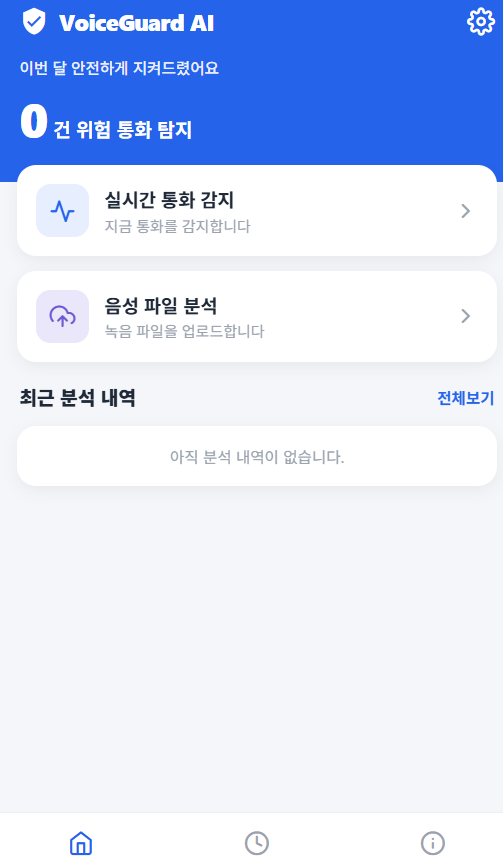
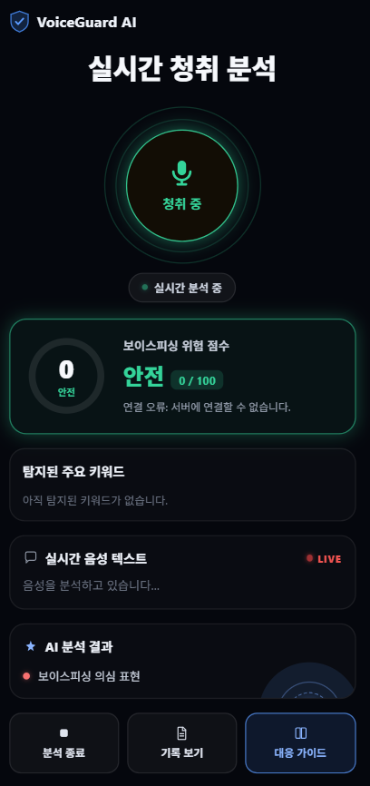
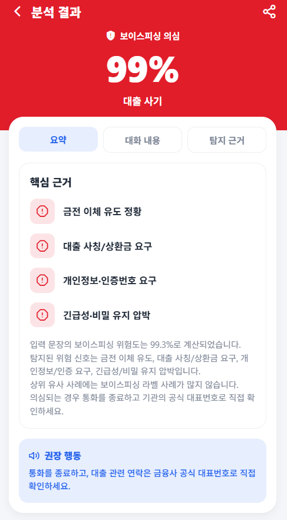
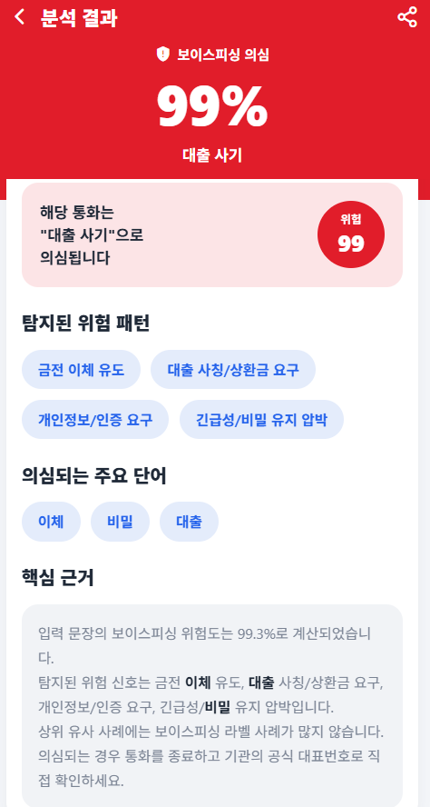
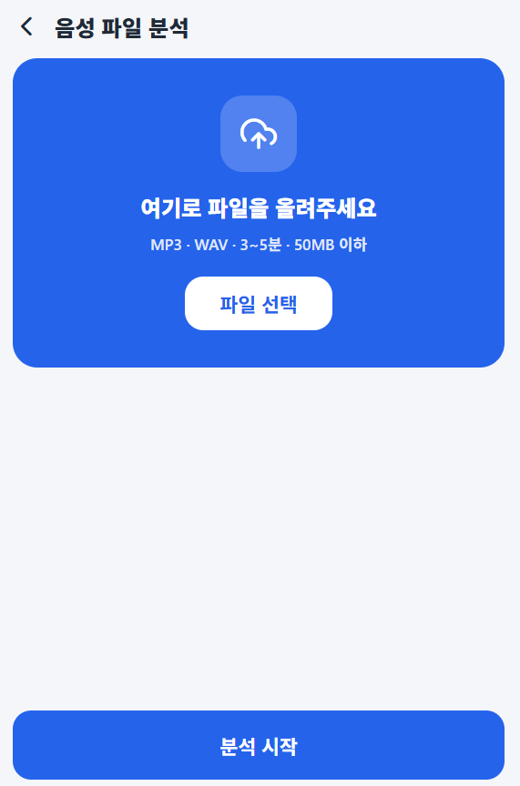
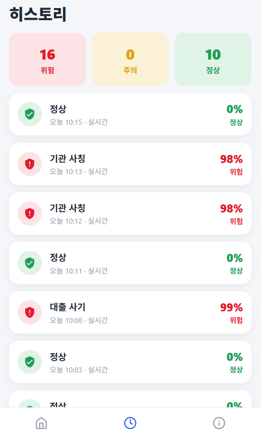
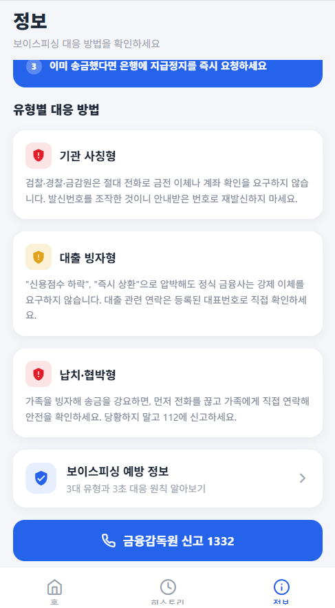
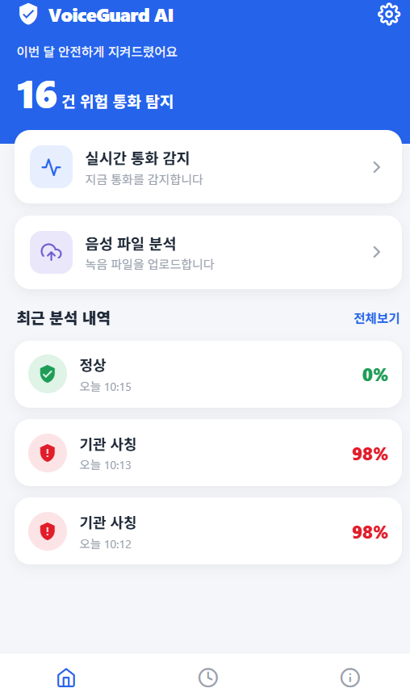
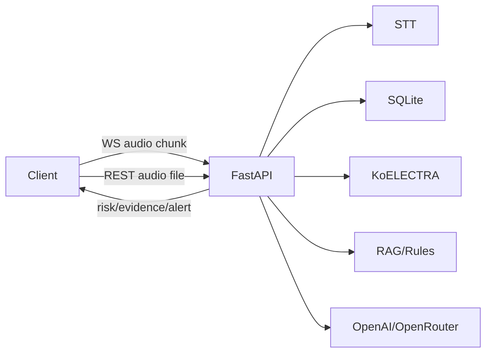

<div align="center">

# 🛡️ VoiceGuard AI

### 실시간 통화 음성 분석 기반 보이스피싱 탐지·예방 서비스

실시간 통화 음성을 전사하고, 누적 통화 내용을 바탕으로 **AI가 보이스피싱 위험도와 핵심 근거를 즉시** 알려줍니다.
React Native(Expo) 앱·웹 프론트엔드와 FastAPI 백엔드로 구성된 풀스택 프로젝트입니다.

<sub>KNU AI BOOT 7조 자율 프로젝트</sub>

</div>

* * *

## 👨‍👩‍👧‍👦 팀 멤버

| 이름 | 역할 |
| --- | --- |
| **이재현** | 자료 조사 및 발표 |
| **장지훈** | 디자인 및 프론트엔드 개발 |
| **박준영** | RAG + 규칙 기반 탐지, API 개발 |
| **최세민** | AI 모델 학습 및 전처리, API 개발 |

* * *

## 🧰 기술 스택

**Frontend**


**Backend**


**AI / STT**


* * *

## 🎨 프론트엔드 (React Native · Expo)

**Expo Router** 기반 파일 라우팅으로 **iOS · Android · Web을 하나의 코드베이스**로 지원하는 크로스플랫폼 앱입니다.
WebSocket으로 실시간 전사·위험도를 표시하고, 녹음 파일 업로드 분석과 통화 히스토리·예방 정보를 제공합니다.

- 🎧 **실시간 청취 분석** — 마이크 오디오를 3초 청크로 WebSocket 전송, 실시간 전사·위험도 갱신
- 📁 **음성 파일 분석** — mp3/wav 녹음 파일 업로드 후 위험도·근거 분석
- 📊 **분석 결과** — 위험도(%), 탐지된 위험 패턴, 의심 단어, AI 핵심 근거 제시
- 🗂️ **히스토리** — 통화별 위험/주의/정상 분류 및 상세 조회
- 📚 **정보** — 보이스피싱 유형별 대응 방법 안내

### 📱 주요 화면

<table>
  <tr>
    <td align="center"><br/><b>홈</b></td>
    <td align="center"><br/><b>실시간 청취 분석</b></td>
    <td align="center"><br/><b>분석 결과 · 요약</b></td>
    <td align="center"><br/><b>분석 결과 · 탐지 근거</b></td>
  </tr>
  <tr>
    <td align="center"><br/><b>음성 파일 분석</b></td>
    <td align="center"><br/><b>히스토리</b></td>
    <td align="center"><br/><b>정보 · 대응 방법</b></td>
    <td align="center"><br/><b>홈 · 분석 내역</b></td>
  </tr>
</table>

### 🗂️ 프론트엔드 구조

```text
frontend/
  app/                    # expo-router 화면
    (tabs)/               #   홈 / 히스토리 / 정보 탭
    realtime.tsx          #   실시간 청취 분석
    upload.tsx            #   음성 파일 업로드 분석
    result.tsx            #   분석 결과 상세
    warning.tsx           #   실시간 위험 경고
  src/
    components/           # 재사용 UI 컴포넌트 (RiskGauge, CallCard ...)
    data/
      services/           # 백엔드 통신 (callsApi, wsService, uploadAudio, STT)
      models/             # 타입 정의
    hooks/                # useCallSession 등
    state/                # zustand 스토어 (call, transcript, settings)
    core/                 # theme, config, utils
```

### ▶️ 프론트엔드 실행

```bash
cd frontend
npm install
npm run web       # 웹
npm run android   # 안드로이드
npm run ios       # iOS
```

`frontend/.env`에 백엔드 주소를 설정합니다.

```env
EXPO_PUBLIC_API_BASE=http://<백엔드-호스트>:8000
```

* * *

## ⚙️ 백엔드 (FastAPI)

실시간 통화 음성을 받아 전사하고, 누적 통화 내용을 기반으로 보이스피싱 위험도와 핵심 근거를 반환하는 FastAPI 백엔드입니다.

### 🌟 주요 기능

- WebSocket 기반 실시간 mp3/wav/m4a 오디오 chunk 분석
- mp3/wav/m4a 녹음 파일 업로드 분석
- KoELECTRA 기반 위험도 산출
- RAG/규칙 기반 유사 사례 검색 및 위험 패턴 탐지
- OpenAI/OpenRouter 기반 핵심 근거 생성
- 통화 기록, 발화, 탐지 결과, 알림 이력 SQLite 저장

### 🧱 아키텍처



### 📁 백엔드 구조

```text
backend/app/
  main.py                 # FastAPI 앱 진입점
  api/
    routes.py             # REST API
    websocket.py          # 실시간 통화 WebSocket
  services/
    audio_transcriber.py  # 오디오 입력 정규화 및 전사 호출
    call_analyzer.py      # 위험도 분석 및 응답 생성
    rag_detector.py       # RAG/규칙 기반 탐지
    evidence_generator.py # 생성형 근거 생성
  database.py             # SQLite 초기화
  repository.py           # DB CRUD
  schemas.py              # Pydantic 스키마
  paths.py                # 공통 경로
data/                     # DB, 학습 데이터
models/                   # 학습 모델
API_SPEC.md               # 상세 API 명세
```

### 🛠️ 사용 기술

- Backend: Python, FastAPI, Uvicorn
- Realtime: WebSocket
- DB: SQLite
- AI: KoELECTRA, PyTorch, Transformers
- RAG: SQLite 사례 검색 + 문자 n-gram similarity
- STT/근거 생성: OpenAI 호환 SDK, OpenRouter

### 📦 설치

```bash
python3 -m venv .venv
source .venv/bin/activate
pip install -r requirements.txt
```

### 🔑 환경 변수

프로젝트 루트에 `.env`를 생성합니다.

```env
OPENAI_API_KEY=sk-or-v1...
OPENAI_BASE_URL=https://openrouter.ai/api/v1
LLM_MODEL=openai/gpt-4o-mini
STT_MODEL=google/gemini-3.5-flash
OPENROUTER_APP_TITLE=VoiceGuard AI
CORS_ALLOW_ORIGINS=http://localhost:8081,http://172.16.80.202:8081
```

### ▶️ 실행

로컬 실행:

```bash
uvicorn backend.app.main:app
```

같은 네트워크의 프론트/모바일에서 접속:

```bash
uvicorn backend.app.main:app --host 0.0.0.0 --port 8000
```

개발 reload:

```bash
uvicorn backend.app.main:app --reload --reload-dir backend --reload-exclude ".venv/*" --reload-exclude ".venv/**"
```

Swagger:

```text
http://127.0.0.1:8000/docs
```

### 🔗 핵심 API

| Method | Path | 설명 |
| --- | --- | --- |
| GET | `/health` | 서버 상태 확인 |
| WS | `/ws/calls/analyze` | 실시간 통화 오디오 분석 |
| POST | `/calls/analyze-audio` | 녹음 파일 업로드 분석 |
| GET | `/calls` | 통화 기록 목록 조회 |
| GET | `/calls/{log_id}` | 통화 기록 상세 조회 |
| POST | `/training-cases/import-json` | RAG/학습 사례 업로드 |
| GET | `/training-cases` | 저장된 학습 사례 조회 |

상세 요청/응답은 [API_SPEC.md](docs/API_SPEC.md)를 참고합니다.
