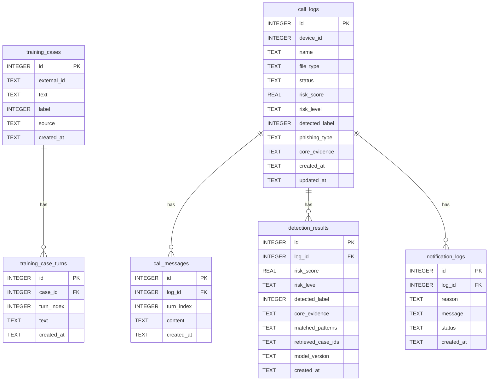

# Voice Phishing Detection ERD

## Relationships

- `training_cases.id` -> `training_case_turns.case_id`
- `call_logs.id` -> `call_messages.log_id`
- `call_logs.id` -> `detection_results.log_id`
- `call_logs.id` -> `notification_logs.log_id`

All child rows are configured with `ON DELETE CASCADE`.

## Notes

- Speaker fields were removed from `training_case_turns` and `call_messages`.
- `call_messages.content` stores the converted/transcribed sentence.
- `detection_results.matched_patterns` and `detection_results.retrieved_case_ids` are stored as JSON strings.
- `call_logs` stores the latest summarized detection state, while `detection_results` stores detection history.
